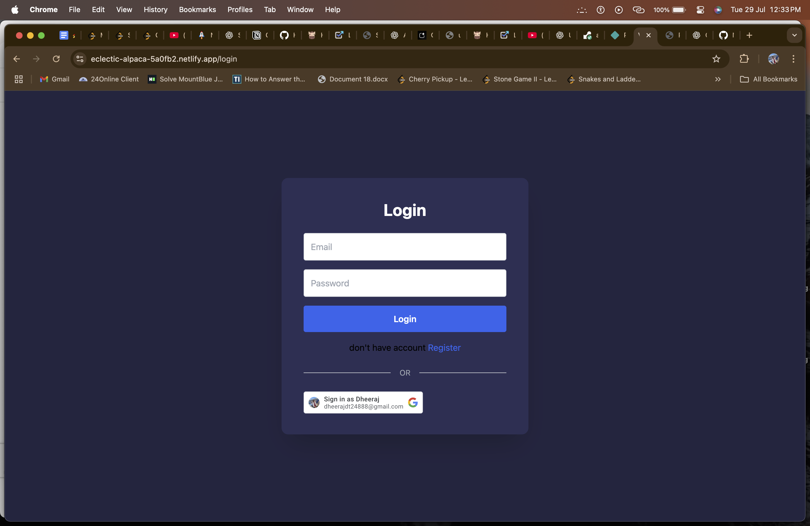
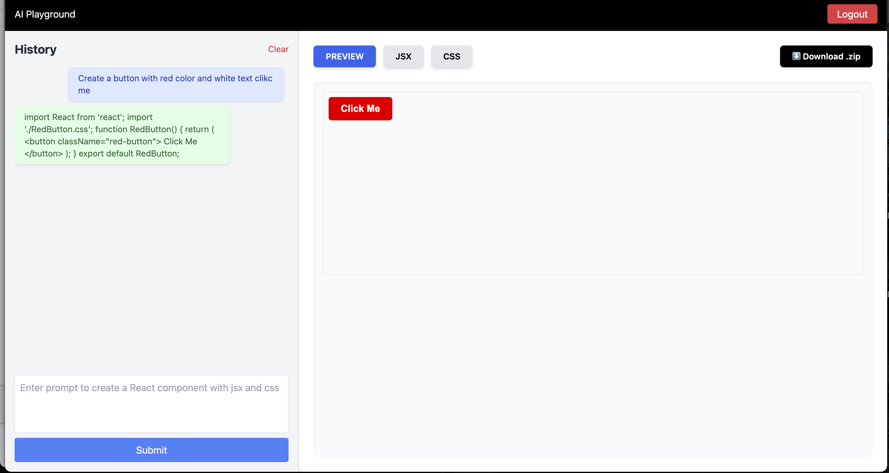
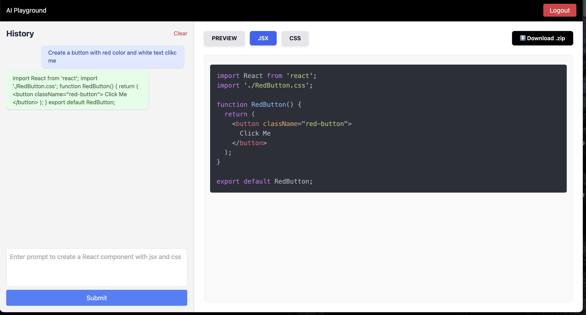

# 🎨 AI UI Playground

> A powerful web-based tool that allows users to chat with an AI (Gemini) and generate interactive UI components in real time, rendered via a live preview.

---

## 🚀 Features

- 💬 Chat with **Gemini AI** to generate React components
- 🖥️ Live preview of JSX + CSS output
- 📜 View past **chat history**
- 📁 Download generated components as `.zip`
- 🔐 Secure authentication with:
  - Email & Password (JWT)
  -  **Google OAuth**
- 💾 Sessions auto-saved & restored from MongoDB
- 🎨 Syntax highlighting (JSX, CSS) with tabs

---

## 🏗️ Tech Stack

| Layer        | Technology Used                     |
|--------------|-------------------------------------|
| Frontend     | React, Vite, Tailwind CSS           |
| Backend      | Node.js, Express.js                 |
| Auth         | JWT + bcrypt + 🔐 **Google OAuth**   |
| AI Model     | Gemini API                          |
| Database     | MongoDB + Mongoose                  |
| Utilities    | Babel, ReactDOM, JSZip              |

---

## ⚙️ How It Works

1. 🔐 Login with **Email/Password** or **Google OAuth**
2. 💬 Prompt Gemini AI → Generates **JSX + CSS**
3. 📦 AI response is stored in:
   - `localStorage` (frontend)
   - MongoDB (backend) as session history
4. 🖥️ JSX & CSS are rendered live using **Babel** and **iframe sandbox**
5. 🧾 Users can switch tabs to view:
   - `Preview` (Live Render)
   - `JSX Code`
   - `CSS Code`
6. 📁 Download the generated component as a `.zip` file

---
## Folder Structure
```
📦 root
├── backend
│   ├── controllers/       # AuthController (google Oauth)
│   ├── middleware/        # AuthMiddleware 
│   ├── routes/            # API routes (auth , prompt ,session)
│   ├── models/            # Mongoose models (User, Session)
│   └── server.js          # Express entry point
│
├── frontend
│   ├── src/
│   │   ├── components/     # ChatPanel, PreviewPanel, LivePreview, codetabs.
│   │   ├── context/        # Auth Context
│   │   ├── pages/          # Login, SignUp, Home
│   │   ├── protected/      # PrivateRoute for authenticated pages
│   │   ├── App.jsx         # App routes
│   │   └── main.jsx        # Vite root
│   └── index.html
```

---
## Environment Variables
### Backend .env

```
PORT=8001 or your port number
MONGODB_URI=your_mongodb_connection_string
JWT_SECRET=your_jwt_secret
GOOGLE_CLIENT_ID=your_google_client_id
GOOGLE_CLIENT_SECRET=your_google_client_secret
GEMINI_API_KEY=your_gemini_api_key
CLIENT_ENDPOINT=your_client_endpoint
```

---

## 🛠️ Local Setup

### 🔧 Backend

```bash
cd backend
npm install
npm run dev
Make sure you configure your .env file with MongoDB, JWT secret, and Google OAuth credentials.
```
---

### 🔧 Backend

```bash
cd frontend
npm install
npm run dev
```
---

---

## 🖼️ Screenshots

### 🔐 Login Page


### 💬 Chat Interface with Gemini


### 🖥️ Live JSX + CSS Preview


---


